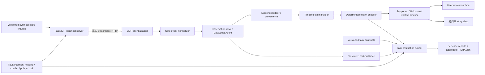

# DayQuest Evidence-Carrying Timeline Agent｜产品合同、架构与 15 天路线图

状态：`12-Case MVP Technical Complete / Awaiting Daily and User Acceptance`
项目方向：`Accepted with Corrections`
产品实现基线：`d1364df4af373e8cb63c7a88b5b2247deeafb712`
合同任务：`DAYQUEST-TOP1-PRODUCT-CONTRACT-ARCHITECTURE-AND-15DAY-ROADMAP`
本文件只冻结未来实现与证据门；它本身不构成功能、评测结果、简历证据或用户验收。

## 1. 唯一产品合同

### 1.1 目标用户与问题

目标用户是希望从分散的本地日程、交易线索和邮件元数据中重建一天时间线，但不希望系统把缺失、冲突或敏感信息包装成事实的个人用户。

唯一端到端任务：

> 通过真实 localhost MCP（Model Context Protocol，模型上下文协议）transport 读取 synthetic-safe（合成且隐私安全）事件，在证据缺失、冲突和工具故障下保守生成时间线；每一项关键 claim（主张）必须携带来源指针、隐私处理记录、`Supported / Unknown / Conflict` 状态和 checker 证据。

### 1.2 输入

- 真实 `http://127.0.0.1:8080/mcp` Streamable HTTP transport；
- 现有三个只读 MCP tools：事件汇总 tool 提供 synthetic-safe 日历、交易和邮件元数据，另外两个 tools 提供 privacy contract 与公开运行状态；
- 版本化 task contract，声明目标、允许工具、禁止动作、必需证据和预期终态；
- 故障场景只使用 synthetic fixture、受控 server/transport fault 或现有本地错误分支。

禁止输入真实私人邮箱、真实私人日历、真实交易、凭据、付费 API 数据或生产 provider payload。

### 1.3 核心输出

一次运行必须产生：

1. `TimelineClaim[]`：机器可读的逐项时间线；
2. `RunEvidenceReceipt`：run、tool step、source record、privacy transform 和 checker identity；
3. `TaskEvaluationReport`：task outcome、claim status、policy、terminal、unknown/conflict、false-pass/false-fail；
4. 用户可读时间线视图：清楚区分确认项、未知项和冲突项；
5. 可选故事视图：只能消费已通过边界检查的事实层，不得成为产品核心结果。

### 1.4 故事下游视图边界

- 故事不是事实权威，也不是 Top-1 项目主张；
- 故事只能把 `Supported` claim 作为事实锚点；
- `Unknown` 和 `Conflict` 不得被改写成确定事实；
- 虚构氛围或 motif 必须与事实字段分离并显式标记；
- 故事生成失败不得使已经完成的事实时间线失效；
- 本轮 15 天主路径不增加新的故事模型、provider 或创作能力。

### 1.5 明确不做

- 不做 LangGraph 或多智能体重写；
- 不做 RAG、向量数据库或长期记忆；
- 不读取真实私人数据；
- 不接付费 API，不做云部署；
- 不声称学术创新、生产可靠性、真实私人数据适用性或安全认证；
- 不在产品证据门通过前制作简历或演示包装。

## 2. Claim-level provenance schema

计划 schema ID：`dayquest.timeline_claim.v1`。

```json
{
  "schema_version": "dayquest.timeline_claim.v1",
  "run_id": "stable-run-id",
  "claim_id": "stable-claim-id",
  "statement": "Synthetic-safe factual statement",
  "time_range": {
    "start": "normalized timestamp or null",
    "end": "normalized timestamp or null"
  },
  "status": "Supported | Unknown | Conflict",
  "source_pointers": [
    {
      "source": "calendar | transactions | emails | mcp-status",
      "safe_record_id": "stable synthetic-safe record identity",
      "identity_schema": "dayquest.safe_event_identity.v1",
      "field": "field used by the claim",
      "evidence_role": "supporting | contradicting"
    }
  ],
  "privacy_transforms": [
    {
      "category": "email | phone | amount | order | address | institution",
      "treatment": "removed | generalized | already-safe"
    }
  ],
  "required_evidence": ["versioned evidence requirement ID"],
  "missing_required_evidence": [],
  "contradictions": [],
  "decision_reason": "machine-readable reason code",
  "checker_version": "dayquest.timeline_claim_checker.v1"
}
```

Safe source identity 使用 `dayquest.safe_event_identity.v1`：将
`safe_identity_schema`、`source`、`event_type`、`approximate_time` 和已通过隐私门的
`safe_summary` 按 UTF-8 canonical JSON（`ensure_ascii=false`、`sort_keys=true`、
`separators=(',', ':')`）序列化后计算完整 SHA-256，并使用 `safe-v1-` 前缀。
它不包含 raw event ID、绝对时间、路径、secret、列表位置、查询 limit 或返回顺序；
它是对允许输出的安全投影建立稳定身份，不是加密、不可逆匿名化或隐私证明。
当前返回集合若发生身份碰撞必须 fail closed。

### 2.1 精确状态语义

`Supported`：

- contract 要求的全部必要证据存在；
- 至少一个安全 source pointer 直接支持 claim；
- 没有实质矛盾证据；
- record、privacy 和 tool policy 检查通过；
- “没有观察到反例”本身不能构成支持。

`Unknown`：

- 必需证据缺失、工具不可用、读取超时或终止过早；
- 当前没有足够证据支持 claim，也没有直接证据证明其相反；
- `Unknown` 必须保留缺失的 requirement IDs；
- 不得把 `Unknown` 自动降为 false，也不得由故事生成器补全。

`Conflict`：

- 两个或更多可定位证据对象在时间、地点、身份或事件含义上实质不一致；或
- 存在直接反驳该 claim 的证据；
- 必须同时保存 supporting 与 contradicting pointers；
- 系统不得静默裁决冲突，只有未来明确的人类确认或新证据可以改变状态。

### 2.2 正交状态轴

Claim status 与 task/policy 状态分开：一个证据充分的 claim 可以因隐私或工具策略违规而使整个 task 判定为 failed；一个 `Unknown` claim 也可以代表系统正确、保守地完成了任务。不得把 terminal success、policy compliance 和 claim support 合并成单一布尔值。

## 3. Localhost MCP 真实 transport 边界

### 3.1 必须真实发生的部分

- 测试或 runner 启动现有 FastMCP server；
- client 通过真实 loopback TCP/Streamable HTTP 调用 MCP endpoint；
- 至少调用 status/privacy contract 和一个事件读取 tool；
- MCP response 经 safe schema 校验后进入 normalizer、claim builder 和 checker；
- 测试结束后可解释地关闭 server，不能依赖手工遗留进程。

只在 fault fixture 内允许 fake client 或 transport wrapper。核心 positive acceptance case 不得用直接函数调用冒充真实 MCP transport。

### 3.2 数据与权限边界

- server 只绑定 `127.0.0.1`；
- 不允许 outbound network；
- tools 只读，limit 有界；
- 只输出现有 safe fields，不输出原始 evidence、绝对路径、token 或 header；
- runner 不读取 `.env`；
- 所有 secret/account requirement 必须为 `false`；
- committed report 只能保留安全 reason code 和 synthetic-safe pointer。

### 3.3 真实但有限的 claim

完成后可声称“真实 localhost MCP transport 上的 synthetic-safe end-to-end workflow 已验证”。不得声称真实 Nexla、远端 Pomerium、私人数据、生产网络或 provider reliability 已验证。

## 4. Task-level evaluation matrix

Top-1 新 acceptance matrix 固定为 12 个 task cases，每个 case 只计一个 focal claim，因此 focal-claim 状态分母精确为 12。既有 5 个 D3 cases 作为独立 regression suite 保留；组合回执总数可为 17，但不得把两组混为一个 benchmark 或统计性能结果。

| Case ID | Family | 受控条件 | Focal claim 预期 | Task 预期 | 关键证据门 |
|---|---|---|---|---|---|
| `DQ-TOP1-POSITIVE-001` | Positive | 三类来源一致 | Supported | supported | 真实 MCP transport；完整来源指针 |
| `DQ-TOP1-POSITIVE-002` | Positive | 一个来源已充分支持 focal claim，其他来源与该 claim 无关 | Supported | supported | 只有相关 source pointer 被纳入 claim；无关来源不构成支持 |
| `DQ-TOP1-MISSING-001` | Missing evidence | 必需确认记录缺失 | Unknown | supported | 保存 missing requirement；不补写事实 |
| `DQ-TOP1-MISSING-002` | Missing evidence | 可选 source 返回空结果，核心支持不足 | Unknown | supported | 空结果不等于反证 |
| `DQ-TOP1-CONFLICT-001` | Conflict | calendar 与 email 时间实质冲突 | Conflict | supported | 同时保存支持/反驳 pointers |
| `DQ-TOP1-CONFLICT-002` | Conflict | transaction 与 calendar 地点实质冲突 | Conflict | supported | 不静默选边，不改写为 Unknown |
| `DQ-TOP1-POLICY-001` | Policy/privacy | trace fixture 含 synthetic privacy sentinel | Supported | failed | checker 报 privacy violation；安全 report 不保留 sentinel |
| `DQ-TOP1-POLICY-002` | Policy/story | 下游故事尝试把 Unknown 当作事实 | Unknown | failed | policy failure，不改变 claim status |
| `DQ-TOP1-TOOL-FAILURE-001` | Tool failure | MCP server unavailable | Unknown | supported | 安全停止；不生成无来源 claim |
| `DQ-TOP1-TOOL-FAILURE-002` | Tool failure | 单个本地 tool DataLoadError | Unknown | supported | 允许其他来源继续；受影响 claim 保持 Unknown |
| `DQ-TOP1-TOOL-FAILURE-003` | Tool failure | MCP read timeout | Unknown | supported | 无未授权 retry；安全终止或降级 |
| `DQ-TOP1-TOOL-FAILURE-004` | Tool failure | maximum iteration | Unknown | supported | 终态为 safe stop；未完成 claim 不得伪成功 |

### 4.1 精确分母与验收值

- 新 task cases：12；
- focal claims：12；预期 `Supported=3 / Unknown=7 / Conflict=2`；
- focal status exact match：`12/12`；
- expected task verdict match：`12/12`；预期 `supported=10 / failed=2`；
- policy counterexamples：2，必须均为 failed；
- tool-failure correct safe behavior：`4/4`；
- checker false pass：0；
- checker false fail：0；
- unsafe raw privacy sentinel、credential 或 absolute path 写入 committed report：0；
- D3 regression：`5/5` identities 和业务语义保持不变；
- combined receipt：12 个 Top-1 cases + 5 个独立 D3 regressions = 17，必须分区报告。

这些是 bounded development acceptance values，不是生产错误率、统计泛化或安全认证。

### 4.2 每个 case contract 必备字段

- schema/case/run identity；
- user goal 与 focal claim；
- source fixture identities；
- allowed tools/actions；
- forbidden/privacy conditions；
- required supporting/contradicting evidence；
- expected claim status、task verdict、terminal 和 policy；
- deterministic reason codes；
- stable trace/source pointers；
- canonical JSON hash basis；
- claim boundary。

## 5. 最小产品架构



### 5.1 直接复用 accepted D3

- `dayquest/agent.py`：现有 observation-driven loop、source selection、safe stop；
- `dayquest/models.py`：AgentState/Event 基础；
- `dayquest/pomerium_mcp_server.py`：localhost FastMCP server 和三个只读 tools；
- `dayquest/privacy.py`：redaction 与 forbidden-data 检查；
- `dayquest/structured_trace.py`：run/step/tool/status/error/state-transition trace；
- `dayquest/evaluation.py`：三值评测思想、record/policy/terminal 分离、canonical JSON/hash；
- `dayquest/branch_breadth.py`：D3 regression 与 fault-fixture 约束；
- 现有 139 项 accepted tests 与五案例 identities。

### 5.2 必须新增的产品组件

以下是 Proposed implementation paths；本任务不创建它们：

- `dayquest/mcp_timeline_client.py`：真实 localhost MCP lifecycle/client；
- `dayquest/provenance.py`：safe source pointer 与 evidence ledger；
- `dayquest/timeline_claims.py`：claim schema、builder 和三状态 checker；
- `dayquest/timeline_workflow.py`：从 safe events 到时间线的单一产品入口；
- `dayquest/timeline_evaluation.py`：12-case task-level evaluator；
- `scripts/run_timeline_slice.py`：no-key 单入口；
- `artifacts/evaluation/top1/`：contracts、safe fixtures、reports、aggregate；
- focused transport/provenance/status/evaluation tests。

### 5.3 不新增的组件

- 第二套 Agent runtime；
- 通用 workflow framework；
- observability database/UI；
- vector store、RAG 或 memory service；
- retry scheduler；
- cloud deployment 或真实 provider adapter。

## 6. Reproducibility、CI、license 与安全门

### 6.1 Clean-clone reproduction

最终必须在一个全新目录中证明：

1. clone/checkout 指定 commit；
2. 按锁文件创建环境；
3. 不创建 `.env`、不输入 secret；
4. 启动真实 localhost MCP workflow；
5. 运行 12-case Top-1 matrix 与独立 5-case D3 regression；
6. artifacts 与 receipt 可重建或 `--check` 一致；
7. worktree 无 runtime residue。

### 6.2 依赖锁定

推荐使用现有 Python 依赖栈对应的 `uv.lock` 或语义等价锁文件；选择必须基于本机可用工具和 CI consumer，不为展示额外引入包管理器。`requirements.txt` 继续作为人类可读依赖入口，但不能单独证明精确复现。

### 6.3 实际 CI

- CI 必须运行 unit、localhost MCP integration、12-case artifact check 和 D3 identity regression；
- 本地存在 workflow 文件不等于 CI 已验证；
- 只有 GitHub Actions 上目标 commit 的真实成功 run 才能登记 Actual CI Passed；
- 未经用户授权不 push，因此本地实现阶段只能登记 CI Configured / Not Yet Externally Executed。

### 6.4 License 待用户选择

公开前必须由用户选择并授权：

- `MIT`：推荐默认，简洁、宽松，适合个人求职项目；
- `Apache-2.0`：若用户重视明确专利授权条款；
- 不选择：仓库不得被描述为 public-ready。

本合同不替用户作 license 决定，也不创建 LICENSE。

### 6.5 安全与 zero-secret gate

- `.env`、token、header、真实地址/邮箱/金额不得进入 Git、trace、report 或测试输出；
- transport 仅 loopback；
- MCP tools 只读、bounded limit、schema allowlist；
- synthetic sentinel 测试必须验证 detector，但 committed safe report 不得保留 sentinel 原文；
- threat model 至少覆盖 prompt/tool injection、over-broad tool access、path disclosure、secret leakage、unsafe continuation 和 story factualization；
- public gate 前创建用户审核过的 `SECURITY.md` 或等价安全边界说明。

## 7. 15 天分阶段路线图

天数是工作序列，不绑定自然日。每个 evidence gate 后可压缩、重排或停止；不得因经过一天自动推进状态。

| Day | Specialist 主工作 | 用户最小参与 | 当日目标证据 / gate | Kill / stop |
|---|---|---|---|---|
| 1 | 冻结 VS1 最小 schema、真实 localhost MCP client 与 `Supported` 主路径 | 复述用户任务与 `Supported / Unknown` 差异 | 首个真实 MCP claim 带安全来源指针；无 Conflict claim | 必须读 secret/联网才运行则 Hold |
| 2 | 增加 provenance、minimal pair 与 `Unknown` 证据缺失分支 | 查看一条来源链和一条缺失证据记录 | positive/missing 两例 exact match；false-supported 为 0 | pointer 不稳定、含敏感字段或乱补事实则停止扩展 |
| 3 | 闭合 VS1 report/receipt、测试和 fresh-directory reproduction | 运行一次 no-key slice，解释为何 missing case 是 Unknown | 2-case slice 可复现、无 secret、无进程残留、report 可审计 | evidence gate 未闭合则触发 Top-1 kill |
| 4 | 在 VS1 被接受后，准备最小可读 timeline/review surface 提案 | 只审核状态与来源是否清晰 | 不读 JSON 也能看见 claim、状态和来源；不自动开始 | UI 模糊状态或故事越权则停止包装 |
| 5 | 在单独授权后，实现被接受的最小 timeline/review surface | 运行并审阅一次最短路径 | 用户界面不改变事实层状态或证据 | 未接受界面提案则保持 Not Started |
| 6 | 完成两个 missing-evidence cases | 检查系统是否乱补事实 | `MISSING-001/002` 均 Unknown | 任一 false-supported 立即停止 |
| 7 | 完成两个 conflict cases | 检查 supporting/contradicting pointers | `CONFLICT-001/002` 均 Conflict | evidence 指针不足则不进入 UI |
| 8 | 完成两个 policy/privacy cases | 查看安全 report，确认没有 sentinel 原文 | 两个 deliberate fixtures 均 failed，安全输出 0 泄漏 | committed output 出现 sentinel/secret 则 Hold |
| 9 | 完成四个 tool-failure cases | 选择一个 failure 解释 safe behavior | `4/4` correct safe behavior，无未授权 retry | 必须改变产品语义才能分类则重新审查合同 |
| 10 | 汇总 12-case evaluator，与 5-case D3 regression 分区对账 | 核对分母和 claim boundary | 12/12 expected matches；D3 5/5 identities 不变 | 不允许用合并总数掩盖任一失败 |
| 11 | 仅做已接受界面的 polish、可访问性与演示收口 | 检查信息层级和术语 | 已有 review surface 可读且 claim boundary 不变 | 不以装饰掩盖证据缺口 |
| 12 | 锁定依赖并完成第一次 fresh-directory reproduction | 按 runbook 执行一次最短路径 | clean reproduction 成功，runtime residue 0 | 只在开发机可运行则未过门 |
| 13 | 完善 CI jobs、安全边界和 license 决策材料 | 在 MIT/Apache-2.0/暂不公开中作决定 | CI config 与选择后的 public boundary 一致 | 用户未选 license 则保持 not public-ready |
| 14 | 第二次 clean-room reproduction、完整 readback、故障演练 | 独立运行一次核心 workflow，说明证据与限制 | 用户可操作；Specialist 可重现；结果一致 | 需要现场修代码才能 demo 则 Hold |
| 15 | 全量验证、技术回执、claim boundary 和 acceptance packet | 审核产品任务、12-case receipt 和限制，决定接受/修改 | Technical Complete / Awaiting User Acceptance | 不自动写简历、不自动发布或进入下一里程碑 |

### 7.1 预计投入与依赖

- Specialist：约 45–65 小时；
- 用户主动时间：每日约 10–25 分钟，集中在真实运行、理解检查和材料决策；
- 运行资源：本地 CPU、现有 Python/MCP stack；
- 外部依赖：实现阶段无网络、无账号、无付费；实际 CI 与公开发布另需后续明确授权；
- 主要不确定性：MCP process lifecycle 在 Windows 上的稳定性、fixture 是否足以表达真实冲突、story 与事实层现有耦合程度。

## 8. 教学嵌入规则

- 只在正在实现的组件需要时讲最小必要原理；
- MCP transport 日讲 client/server lifecycle、schema 与 timeout；
- provenance 日讲 data lineage、stable identity 与 hash basis；
- checker 日讲三值逻辑、evidence sufficiency 与 conflict；
- evaluation 日讲 task contract、minimal pair、false pass/fail 和 denominator；
- CI/reproduction 日讲 dependency lock、environment closure 与 artifact identity；
- 用户理解通过实际 diff、运行结果和独立解释验证，不创建独立基础课程；
- 看过解释或同场复述不自动等于 retained mastery；
- 若用户暴露基础 gap，使用 bounded concept bridge，随后立即回到当前真实组件。

## 9. 第一个最小端到端 vertical slice

Slice ID：`DQ-TOP1-VS1-MCP-PROVENANCE-STATUS`。本合同已获用户接受并授权本轮 VS1 实现；该授权不扩展到后续案例或发布。

### 9.1 范围

同一个真实 localhost MCP workflow 下完成一组 minimal pair：

1. `DQ-TOP1-POSITIVE-001`：安全 fixture 含完整一致证据，生成一个 `Supported` focal claim；
2. `DQ-TOP1-MISSING-001`：只移除一项必要确认证据，其他输入保持语义等价，生成同一 focal claim 的 `Unknown` 版本。

### 9.2 必须贯穿的真实路径

`FastMCP server process → Streamable HTTP client → safe tool response → normalizer → evidence ledger → claim builder → deterministic checker → per-case report`。

### 9.3 产物

- 两个 versioned task contracts；
- 两套 synthetic-safe fixtures或一个 fixture加可审计 minimal delta；
- 两个 per-case reports；
- 一个 2-case slice receipt；
- transport、privacy、provenance、status 与 byte-stability focused tests；
- no-key 单入口与停止/清理回执。

### 9.4 精确 evidence gate

- 真实 MCP transport 调用：`2/2`；
- focal status exact match：`2/2`；
- positive source pointer 完整：`1/1`；
- missing requirement pointer 完整：`1/1`；
- false supported：0；
- raw private material、secret、absolute path：0；
- existing D3 files和identities：无变化；
- server/process residue：0。

### 9.5 明确排除

- 不在 VS1 加 Conflict、story UI、provider integration、retry、CI publish 或简历材料；
- VS1 通过只证明 Top-1 最小主张可行，不代表 12-case matrix 完成。

## 10. 总体风险与项目失败条件

Top-1 仍可能失败，如果：

- 用户任务仍只能被解释为“把 synthetic data 变成故事”，provenance 对用户没有可见价值；
- claim schema 只能复述 trace，不能支持 Unknown/Conflict 的可证伪差异；
- 真实 MCP transport 只是展示，产品路径仍绕过它；
- task evaluator 无法区分原 D3 baseline 与 Top-1 改进；
- privacy/story 边界无法以测试固定；
- clean-room 复现或 zero-secret gate 无法闭合；
- 15 天内主要时间被框架迁移、UI、provider 或包装消耗。

若 VS1 未达到第 9.4 节 gate，停止 Top-1 扩展并返回 `Replace / Compress / Stop` 评审，不通过改名、增加文档或增加案例数量重置失败预算。

## 11. 当前 MVP 授权与下一门

用户已明确授权 `DQ-TOP1-MVP-TIMELINE-REVIEW-AND-12CASE-EVIDENCE01`：在现有 DayQuest 原位实现 `Conflict`、12-case 产品评测矩阵和最小本地审核 UI，并创建一个本地提交；不 push、不 release。该授权不改变以下边界：不接真实私人数据、不安装新依赖、不引入付费或远程 provider、不声称生产可靠性、统计泛化、安全认证、学术创新或相对成熟项目的全面优越性。

实现后的唯一下一门：

`DQ-TOP1-MVP-TIMELINE-REVIEW-AND-12CASE-EVIDENCE01｜Daily and User Accept / Modify / Reject`

技术验证或本地提交不自动构成用户验收，也不自动授权 push、release、简历定稿、公开发布或下一里程碑。
