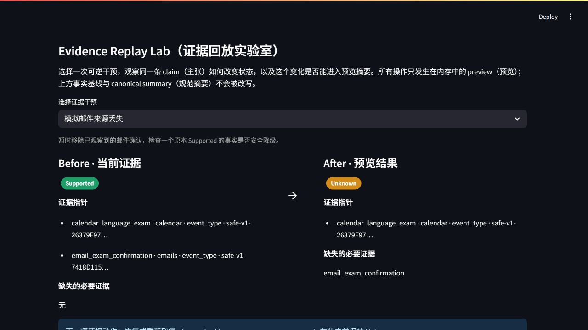
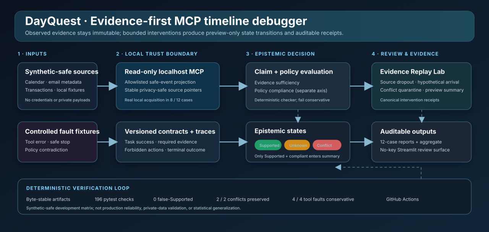

# DayQuest

**An evidence-first MCP timeline debugger that keeps `Supported`, `Unknown`, and `Conflict` explicit—then lets reviewers replay bounded evidence changes without rewriting canonical history.**

[](https://github.com/SakuraLu0001/dayquest-agent/actions/workflows/ci.yml)
[](LICENSE)
[](requirements.lock.txt)



_Real local Product V2 capture from the no-key Streamlit path. Removing one observed email pointer safely degrades the claim from `Supported` to `Unknown`; the canonical summary remains unchanged._

## Three-step no-key quickstart

```powershell
# 1. Install the exact verified environment
python -m pip install -r requirements.lock.txt

# 2. Verify the committed Product V2 artifact
python -B scripts/run_product_v2.py --check

# 3. Open the local review surface
python -B scripts/run_product_v2.py
```

No `.env`, provider login, model download, or external service is required for Product V2, the 12-case evaluation matrix, or the transparent comparison benchmark.

## Why DayQuest exists

Ordinary agent logs tell a reviewer what the system did. DayQuest asks a harder question: **what does the available evidence actually support?**

It binds each timeline claim to privacy-safe source pointers, keeps evidence sufficiency separate from policy compliance, and fails conservatively when evidence is missing, contradictory, or produced by a controlled tool failure. Only `Supported` **and** policy-compliant facts may enter the constrained summary.

| State | Meaning | Summary behavior |
|---|---|---|
| `Supported` | Every required evidence role is present and no contradiction remains | Eligible only when policy-compliant |
| `Unknown` | Required evidence is missing, unavailable, or not observed | Never factualized |
| `Conflict` | Supporting and contradicting evidence coexist | Preserved for review; never auto-resolved |

## Product V2 · reversible evidence replay

The Evidence Replay Lab applies three deterministic, preview-only interventions to immutable V1 reports:

1. **Source dropout:** remove an observed email confirmation → `Supported → Unknown`.
2. **Hypothetical evidence arrival:** add an explicitly hypothetical calendar pointer → `Unknown → Supported` in preview only; a real read-only source check is still required before promotion.
3. **Conflict quarantine:** quarantine one contradicting location pointer → `Conflict → Unknown`, never automatic `Supported`.

Every replay records the operation, before/after state, next evidence action, baseline report identity, and a canonical `dayquest.intervention_receipt.v1` receipt. The canonical timeline and summary are never modified by replay.

## Architecture



The primary route is local and inspectable:

- synthetic-safe calendar, email-metadata, and transaction fixtures;
- a read-only localhost MCP safe-event projection with stable evidence pointers;
- versioned task contracts, traces, and controlled fault fixtures;
- deterministic claim and policy checks on separate axes;
- three epistemic states, constrained summaries, replay receipts, per-case reports, and aggregate evidence;
- a no-key Streamlit review surface plus byte-stable local and GitHub Actions checks.

## Verifiable results

Technical baseline accepted with corrections:

- public commit: [`a1322b21f412bbe72376d575ac84053a7b54982b`](https://github.com/SakuraLu0001/dayquest-agent/commit/a1322b21f412bbe72376d575ac84053a7b54982b);
- external CI: [GitHub Actions run `33315509118`](https://github.com/SakuraLu0001/dayquest-agent/actions/runs/33315509118), `success`;
- tests: `196 / 196`;
- Product V2 replay canonical SHA-256: `81D0431BD4E9E712D7FFFDE6ACF7E3DF28B03C7A93465120249CE360B5D4F5D3`;
- 12-case matrix: `3 Supported / 7 Unknown / 2 Conflict`;
- false-Supported decisions: `0 / 12`;
- expected conflicts preserved: `2 / 2`;
- controlled tool-failure cases handled conservatively: `4 / 4`;
- summary leakage from unsupported or non-compliant cases: `0 / 12`.

These are deterministic synthetic-safe development cases—not production reliability, statistical generalization, private-data validation, or a security certification. The full bounded receipt is in [PUBLIC_EVIDENCE_RECEIPT.md](PUBLIC_EVIDENCE_RECEIPT.md); recruiter-facing claim candidates remain in [RESUME_EVIDENCE_CANDIDATE.md](RESUME_EVIDENCE_CANDIDATE.md).

## 12-case evaluation and transparent comparison

Launch the product review flow:

```powershell
python -B scripts/run_timeline_mvp.py
```

Eight cases perform real localhost MCP acquisition. Five retain the MCP response unchanged; three apply an explicit controlled post-MCP transform to create a missing or conflicting condition. Four additional cases are controlled tool-fault fixtures. Reviewers can inspect supporting pointers, contradicting pointers, missing requirements, policy violations, terminal outcome, and summary eligibility.

Run the deterministic comparison:

```powershell
python -B scripts/run_comparison_benchmark.py --check
```

It evaluates the same 12 cases against three disclosed ablations: summarize every non-Unknown claim, allow any support to override missing/contradictory evidence, and promote tool-failure cases to completion. These are diagnostic reference strategies, not reproductions of mature competing products.

## Mature-project comparison boundary

[DAYQUEST_PRODUCT_V2_COMPETITIVE_AUDIT.md](DAYQUEST_PRODUCT_V2_COMPETITIVE_AUDIT.md) fixes exact public commit identities for ActivityWatch, screenpipe, DailyOS, Langfuse, and Phoenix. Those projects already provide mature capture, timeline, search, trace, or evaluation workflows.

DayQuest therefore does **not** present local-first operation, timelines, source references, or an evaluation UI as unique. Its bounded product position is the combination of:

- evidence-role-aware `Supported / Unknown / Conflict` claims;
- reversible evidence interventions against immutable baseline reports;
- conservative summary propagation;
- canonical receipts that bind each preview to its baseline evidence.

This is a documentation / architecture / public-workflow comparison only. Third-party repositories were not installed or executed, and no performance, maturity, novelty, or universal-superiority claim is made.

## Limitations

- The verified matrix uses committed synthetic-safe fixtures, not real private user data.
- The privacy scan covers frozen Windows drive-letter paths, email-shaped text, and Bearer/sk-like token patterns; it is not general secret scanning or cross-platform private-data validation.
- Product V2 replay is preview-only and does not implement evidence promotion into canonical history.
- The 12 cases are deterministic development/acceptance cases, not a statistical benchmark or real-user study.
- There is no production sandbox, distributed evaluation scale, live-provider reliability matrix, tenant isolation, or hostile-input security validation.
- Independent recruiter/interview demonstration and competitive audit remain separate from the technical pass.

## Evidence map

| Layer | Command | Committed output |
|---|---|---|
| Privacy-safe trace | `python -B scripts/generate_synthetic_trace.py --check` | `artifacts/traces/dayquest-synthetic-baseline-v1.jsonl` |
| Two-case checker slice | `python -B scripts/run_evaluation_slice.py --check` | `artifacts/evaluation/day2/` |
| Five-case branch breadth | `python -B scripts/run_branch_breadth_slice.py --check` | `artifacts/evaluation/day3/` |
| Localhost MCP vertical slice | `python -B scripts/run_timeline_slice.py --check` | `artifacts/evaluation/top1/vs1/` |
| 12-case evaluation MVP | `python -B scripts/run_timeline_mvp.py --check` | `artifacts/evaluation/top1/mvp/` |
| Transparent ablations | `python -B scripts/run_comparison_benchmark.py --check` | `artifacts/evaluation/comparison/benchmark.json` |
| Product V2 replay | `python -B scripts/run_product_v2.py --check` | `artifacts/product_v2/replay_demo.json` |

Run the complete repository verification:

```powershell
python -B -m pytest -q -p no:cacheprovider
python -B scripts/generate_synthetic_trace.py --check
python -B scripts/run_evaluation_slice.py --check
python -B scripts/run_branch_breadth_slice.py --check
python -B scripts/run_timeline_slice.py --check
python -B scripts/run_timeline_mvp.py --check
python -B scripts/run_comparison_benchmark.py --check
python -B scripts/run_product_v2.py --check
python -B scripts/scan_public_artifacts.py
```

Tests use local fixtures and fake clients; they do not call provider networks.

## Legacy / Original Hackathon Prototype

DayQuest began as a solo hackathon prototype that reconstructed synthetic calendar, transaction, and email data into a fantasy adventure log. That provider-backed route remains available through:

```powershell
streamlit run app.py
```

The legacy path can optionally use AkashML for one allowlisted fantasy motif, Nexla for normalized synthetic events, and Pomerium for a protected MCP route. Credentials belong only in an ignored local `.env`; raw private payloads, email bodies, exact financial details, credentials, and absolute local paths must never enter fixtures, traces, screenshots, issues, or committed artifacts.

The legacy route is preserved as project history. It is not the primary recruiter demo or the source of the Product V2 evidence claims above.

## Security, license, and public status

- Security and privacy boundaries: [SECURITY.md](SECURITY.md)
- License: [MIT](LICENSE)
- License decision record: [LICENSE_DECISION.md](LICENSE_DECISION.md)
- Publication verification: [PUBLIC_EVIDENCE_RECEIPT.md](PUBLIC_EVIDENCE_RECEIPT.md)
- Post-hackathon development history: [ROADMAP_4_MONTHS.md](ROADMAP_4_MONTHS.md)

DayQuest is a **public resume-flagship technical candidate awaiting independent competitive audit and career integration**. No GitHub Release has been created.
